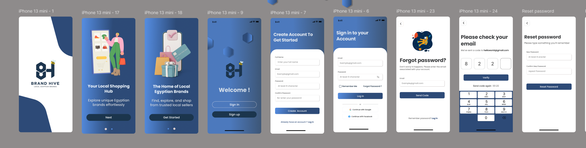
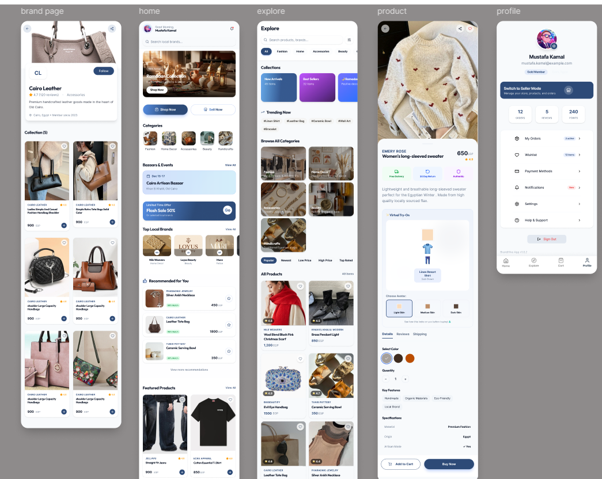
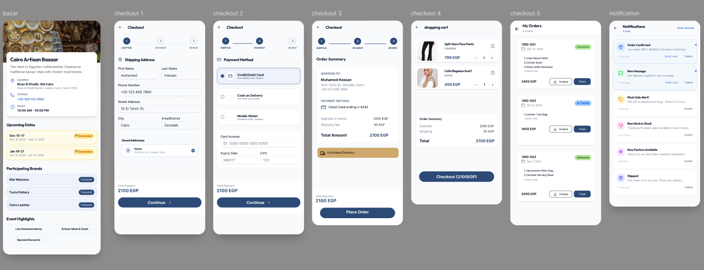
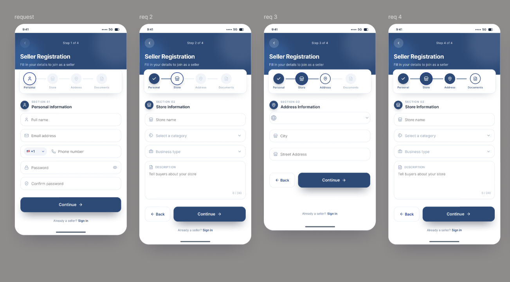
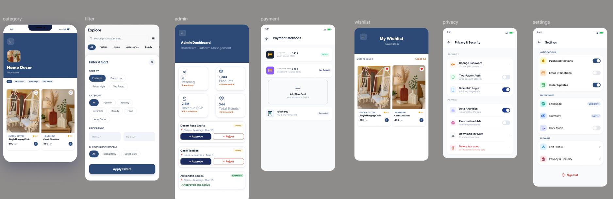
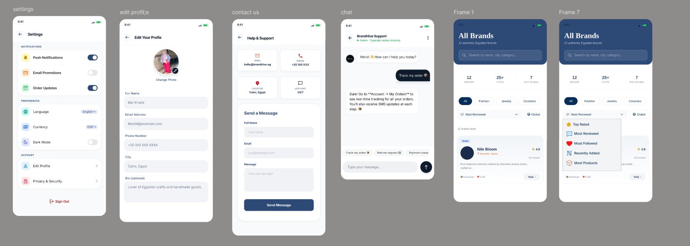

# BrandHive 🐝

## Overview

**BrandHive** is a graduation project that aims to empower local Egyptian brands by providing a complete digital marketplace. The platform connects customers with local businesses through a modern e-commerce experience while giving sellers and administrators the tools they need to manage and grow their businesses.

This project is a starting point for a Flutter application.
 
A few resources to get you started if this is your first Flutter project:
=======
The project consists of a **cross-platform Flutter mobile application**, a **responsive web platform**, and dedicated **Seller** and **Admin** dashboards.

---

## ✨ Features

### 👤 Customer

* User Authentication
* Browse Products by Categories
* Smart Search
* AI-Powered Product Recommendations
* Wishlist
* Shopping Cart
* Secure Checkout
* Order Tracking
* User Profile Management

### 🛍️ Seller Dashboard

* Product Management
* Inventory Management
* Order Management
* Sales Analytics
* Promotions & Discounts

### 🛡️ Admin Dashboard

* User Management
* Brand Approval
* Product Moderation
* Marketplace Analytics
* Platform Monitoring

### 🎪 Bazaar Finder

* Discover Local Bazaars
* Connect Physical Events with Digital Storefronts
* Help Brands Maintain Customer Relationships After Events

---

## 🚀 Tech Stack

* **Frontend:** Flutter, Dart
* **Backend:** Firebase / REST APIs
* **State Management:** *(Provider / Bloc / Riverpod — Update based on your implementation)*
* **Database:** Firebase Firestore *(or your database)*
* **Authentication:** Firebase Authentication
* **Version Control:** Git & GitHub
* **Design:** Figma

---

## 📱 Platforms

* Android
* iOS
* Web

---

## 🎯 Project Goal

BrandHive was created to support local Egyptian brands by providing a complete digital ecosystem that simplifies online selling, improves customer engagement, and helps businesses grow through modern technology and AI-powered features.

---

## 🎨 UI/UX Design

Figma Design:

>https://lnkd.in/eVdgAJ38

---

## 🌐 Live Demo
linkedin:
>https://www.linkedin.com/posts/rahma-mahmoud-383287247_graduationproject-softwareengineering-flutterdeveloper-ugcPost-7474435678538301441-Kl4m/?utm_source=share&utm_medium=member_desktop&rcm=ACoAAD0WQVMBU5f8JbzBbdXOqaLkdNroa6X4eHE
---

Website:

> https://lnkd.in/eYXSSDuz
---
## 📸 Screenshots

### Authentication

### home

### track order

### seller register

### admin dashboard

### settings

---

## 📄 License

This project was developed as a Graduation Project for educational purposes.
